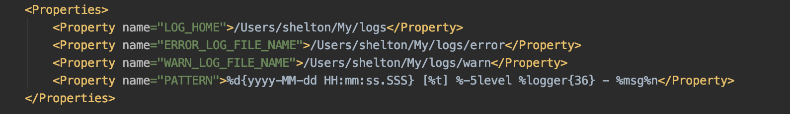
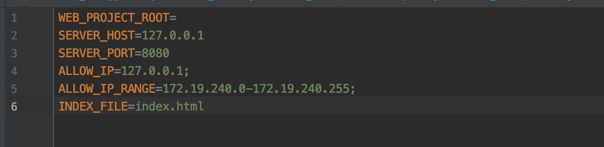

# httpserver

- 首先克隆代码：http://47.101.153.146:3000/NetWorker/httpserver.git

- log4j2.xml中配置日志生成地址：

- httpserver配置文件config.properties:

WEB_PROJECT_ROOT设置需要运行的web项目的根目录，httpserver的资源请求都从此根目录中定位查找。如果不设置，httpserver默认从httpserver项目下的resource文件夹下定位资源。

SERVER_HOST设置httpserver的IP地址

SERVER_PORT设置httpserver的端口

ALLOW_IP设置允许访问的客户端IP地址，建议先不设置

ALLOW_IP_RANGE设置允许访问的客户端IP地址范围，建议先不设置

INDEX_FILE设置默认索引文件

- 入口文件：httpserver/src/main/java/launcher/Main.java，启动项目

- 如果没有设置自己的web项目，httpserver默认展示自带的演示页面：